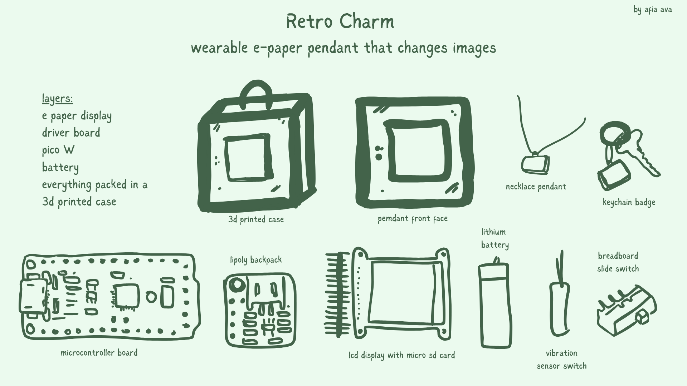

# retro-charm
A wearable retro-pixel jewelry badge that displays animations on a TFT screen. It cycles through retro clouds, pixel art, and animations. Powered by a tiny rechargeable battery, it’s stylish and geeky at the same time.

**Core features:**

- Displays pixel art, image, patterns etc which loops through stored images in th ecard

- It is designed with a hook which can be worn with a necklace as a pendant, be used as a keychain badge, etc. 

- The slide switch changes display modes. 

- It is rechargeable so its lifetime is much longer. 

**Parts:**

- Adafruit Pro Trinket - 5V 16MHz

- 1.44" Color TFT LCD Display with MicroSD Card breakout

- Trinket LiIon/LiPoly Backpack Add-On

- Lithium Ion Polymer Battery - 3.7v 100mAh

- Fast Vibration Sensor Switch 

- Breadboard-friendly SPDT Slide Switch

I recieved all the components to work on this project, and will be updating on progress through a Journal folder. 
